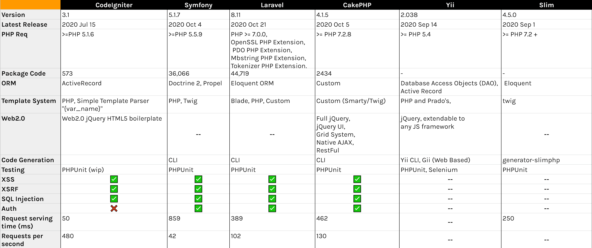

# Brief 10

### Des notions téchniques

- Composer: Un logiciel gestionnaire de dépendances écrit en PHP, il permet d'installer les bibliothèques et de traquer leurs versions.

- Migration: Il s'agit de la gestion des modifications incrémentielles et réversible (version control) aux schémas des BDD relationelles.

- ORM: (Anglais: Object-relational mapping) est une interface qui se place entre un programme (Serveur back-end, application desktop, etc..) et une base de données relationelle pour l'abstraire sous forme d'une base de données orientée objet par la définition des correspondaces entre les schémas de la BDD et les classes du programme.

- Artisan: une ligne de commande (CLI) qui accompagne Laravel et facilite l'accomplissement des tâches telles que la création des models, des controlleurs ou l'éxecution des migrations, etc..

### Les différences entre les frameworks de php

